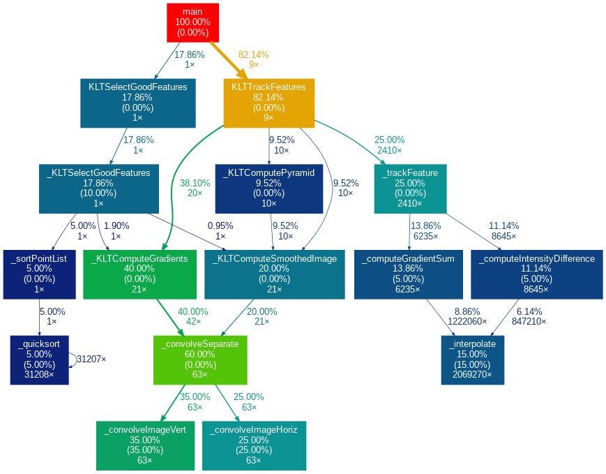
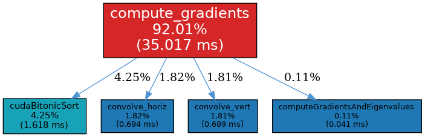
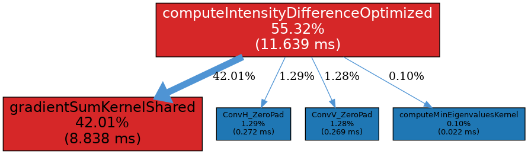
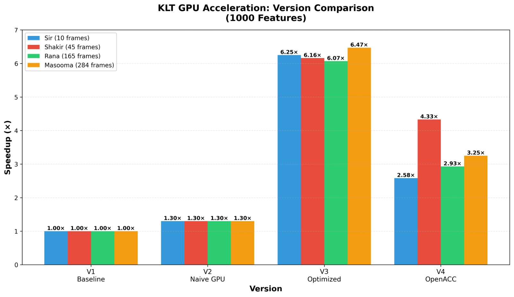
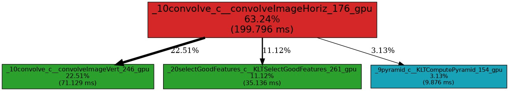

# CS4110 KLT GPU Project
# 🧠 CS4110 – KLT Feature Tracker Profiling (Deliverable 1)

## Deliverable1

## 📘 Overview
This project focuses on *profiling and performance analysis* of the *Kanade–Lucas–Tomasi (KLT)* feature tracking algorithm, which is widely used in computer vision for tracking distinct points (features) across image frames.

The goal of this deliverable is to:
- Compile and execute the *KLT example programs* (specifically example3).
- Generate a *gprof performance profile* and *function call graph*.
- Identify computational hotspots for later optimization (e.g., GPU acceleration).

---

## ⚙️ How to Build and Profile

### 🔧 1. Build & Profile example3
Run the following command inside src/V1/klt:

```bash
make -f Makefile.example3 callgraph
```


This single command will:

Compile the source code (example3.c and related KLT modules).

Run the program to produce profiling data (gmon.out).

Generate a gprof performance report (example3_analysis.txt).

Create a visual call graph (example3_callgraph.png) using gprof2dot and Graphviz.

All generated profiling files are automatically moved to the /profiling folder.

🖼️ Profiling Output Preview
+<p align="center">  </p>

📊 Performance Summary (from example3_analysis.txt)

| Function                 | % Time     | Description                                 |
| ------------------------ | ---------- | ------------------------------------------- |
| _convolveImageHoriz    | *42.86%* | Horizontal convolution (Gaussian smoothing) |
| _convolveImageVert     | *23.81%* | Vertical convolution (image pyramid)        |
| _interpolate           | *14.29%* | Pixel interpolation for subpixel accuracy   |
| _KLTSelectGoodFeatures | *4.76%*  | Detecting high-quality feature points       |
| _computeGradientSum    | *4.76%*  | Computing image gradients                   |
| _quicksort             | *4.76%*  | Sorting features by response strength       |

🔍 Key Observations

The convolution and interpolation stages dominate total execution time.

These operations are repeated for every image pyramid level and pixel neighborhood.

Potential optimization targets:

Parallelize convolution (OpenMP / CUDA).

Use optimized image filtering libraries.

Cache gradient and pyramid computations to avoid recomputation.

🚀 Next Steps

Accelerate heavy functions (_convolveImageHoriz, _convolveImageVert, _interpolate) using GPU or SIMD parallelization.

Compare pre- and post-optimization profiles to quantify performance gains.

📂 Directory Structure

```
CS4110-klt-gpu/
│
├── src/
│   └── V1/
│       └── klt/
│           ├── Makefile.example3         # Build + profile script
│           ├── example3.c                # Example program used
│           ├── profiling/                # Output folder for profiling results
│           │   ├── example3_analysis.txt
│           │   ├── example3_callgraph.dot
│           │   └── example3_callgraph.png
│           └── images/
│               └── pick1.png             # Preview image (included above)
│
└── README.md
```
## V2: GPU-Accelerated KLT Feature Tracker

This version represents the **GPU-accelerated implementation** of the KLT feature tracker. Core computational functions have been ported to CUDA for parallel execution on the GPU, improving performance over the CPU-only baseline (V1).

### Features
- GPU kernels for:
  - `convolve_horiz` and `convolve_vert` (separable convolution)
  - `compute_gradients` (image derivatives)
  - `computeGradientsAndEigenvalues` (gradient magnitudes and eigenvalues)
  - `compute_intensity_difference_kernel` and `compute_gradient_sum_kernel` (per-patch accumulation)
  - `track_features_kernel` (per-feature tracking)
- Naive GPU port with correct results (no advanced memory optimizations yet)
- Profiling support to identify performance bottlenecks

### Performance
- GPU execution time: ~389 ms  
- CPU baseline: ~500 ms  
- Overall speedup: ~1.3×
- `compute_gradient_sum_kernel` dominates runtime (~62% of GPU time)
- Graphical profiling results shown below

### Graphical Profiling



*Location: `src/V2/klt/profiling/gpu_callgraph_from_timings.png`*

### Compilation & Running

All code is compiled using the provided Makefile:


# Navigate to V2 directory

```
cd src/V2/klt
```

# Compile the GPU version

```
make run
```

# Run the example and profile it to draw graph
 ```
make profile_gpu
```


---

## V3: Optimized GPU KLT Feature Tracker

This version introduces **full GPU optimization** using advanced CUDA memory and concurrency techniques. Compared to V2, this version achieves **up to 6.47× speedup**, leveraging multiple GPU memory hierarchies and asynchronous execution.

### 🚀 Key Optimizations
- **Constant Memory** for frequently accessed parameters (fast read-only access).
- **Texture Memory** for hardware-accelerated bilinear interpolation and spatial locality.
- **Batched Feature Processing** to remove per-feature CPU–GPU transfer overhead.
- **Pointer Swapping** for pyramid reuse, eliminating redundant memory uploads.
- **Persistent Buffers** (host & device) to avoid repeated memory allocations.
- **Multiple CUDA Streams** for asynchronous pyramid-level processing and improved GPU utilization.

### 📊 Performance Results

#### GPU Kernel Breakdown
| GPU Operation | % of GPU Time | Execution Time (ms) |
|----------------|---------------|---------------------|
| Intensity Difference | 55.32% | 11.639 |
| Gradient Sum | 42.01% | 8.838 |
| Convolution | 2.67% | – |

<p align="center"></p>
<p align="center"><em>Figure: GPU Kernel Execution Time Distribution</em></p>

#### Speedup Analysis (Clock & Program Time)

| Dataset | Dataset Size | 150 Features | 500 Features | 1000 Features |
|----------|---------------|---------------|----------------|----------------|
| **Program Time Speedup** | | | | |
| 10 (Sir) | 0.661× | 0.675× | 0.705× |
| 45 (Shakir) | 1.767× | 1.853× | 2.010× |
| 165 (Fatima) | 1.624× | 1.703× | 1.932× |
| 284 (Masooma) | 1.574× | 1.849× | 1.866× |
| **Clock Time Speedup** | | | | |
| 10 (Sir) | 5.50× | 5.78× | 6.25× |
| 45 (Shakir) | 5.95× | 6.02× | 6.16× |
| 165 (Fatima) | 6.04× | 6.05× | 6.07× |
| 284 (Masooma) | 6.09× | 6.15× | 6.47× |


### 📈 Observations
- GPU acceleration achieves **6.47× clock-based speedup** and **1.87× real-time speedup**.
- Performance increases with higher feature counts due to effective batched parallelism.
- Memory and stream optimizations reduce CPU–GPU synchronization and allocation overhead.

### Compilation & Running

All code is compiled using the provided Makefile:


# Navigate to V2 directory

```
cd src/V3/klt
```

# Compile the GPU version

```
make -B
```

# Run the example and profile it to draw graph
 ```
./example3
```

### 🧠 Summary
Version 3 delivers a **fully optimized GPU implementation** of KLT using CUDA streams and specialized memory spaces. This version forms the foundation for real-time, scalable computer vision applications.

---

# CS4110 KLT GPU - Version 4 (V4)

## GPU Acceleration of Kanade–Lucas–Tomasi (KLT) Feature Tracking

---

## OpenACC Implementation (V4)

V4 parallelizes major computational bottlenecks identified in previous versions:  

1. **Separable Convolution:** Accelerated Gaussian smoothing and gradient computation using OpenACC parallel loops and device-resident data regions.  
2. **Gradient Computation:** Parallelized across GPU threads, significantly reducing runtime for feature selection and tracking.  
3. **Eigenvalue-Based Feature Scoring:** Structure-tensor eigenvalues for candidate pixels are computed independently per thread.  
4. **Gaussian Pyramid Construction:** Parallelized subsampling and smoothing for efficient multi-level pyramid generation.  

**Memory Management:**  
OpenACC data regions keep intermediate images and pyramid buffers on the GPU, reducing CPU–GPU transfers while preserving algorithmic correctness. Only outer parallel loops were offloaded; sequential execution was preserved where rounding order matters.

---

## ⚙️ How to Build and Profile

### 🔧 1. Build & Profile example3shakir
Run the following command inside src/V4/klt:

```bash
make run
```
Run with OpenACC kernel profiling:
```
NV_ACC_TIME=1 ./example3shakir

```

## Profiling and Performance

### Profiling Breakdown Graph
Shows GPU time distribution across major kernels. Intensity difference computation dominates (~55%), followed by gradient summation (~42%).



### Detailed Performance Metrics
CPU vs GPU speedup across datasets and feature counts:


| Image   | 150 Features | 500 Features | 1000 Features |
|---------|-------------|-------------|---------------|
| Fatima  | 2.01×       | 2.56×       | 2.58×         |
| Shakir  | 5.33×       | 4.31×       | 4.33×         |
| Rana    | 2.80×       | 2.86×       | 2.93×         |
| Masooma | 2.95×       | 3.07×       | 3.25×         |

### V4 Version Comparison
Bar chart showing performance improvements of V4 relative to previous versions:



---

## Key Findings

- GPU acceleration yields higher speedups for larger datasets (e.g., Masooma dataset with 284 frames).  
- OpenACC delivers 2.58× to 4.33× speedup with minimal code changes, while optimized CUDA achieves up to 6.47×.  
- Profiling identifies intensity difference computation and gradient summation as dominant kernels, guiding optimization efforts.  
- Directive-based parallelism (OpenACC) balances ease-of-development with performance gains.

---

## Conclusion

V4 demonstrates that OpenACC can significantly accelerate KLT feature tracking while maintaining code readability, portability, and correctness. It validates that directive-based GPU programming is a practical alternative to hand-optimized CUDA for scientific workloads.  

Future work may include hybrid CPU-GPU scheduling, multi-GPU deployment, and integration with deep learning pipelines for real-time visual computing.

---

**Repository:** [CS4110 KLT GPU on GitHub](https://github.com/FatimaRana50/CS4110-klt-gpu)


👩‍💻 Contributors

Fatima Farrukh Rana
Fatima Shakir
Faateh Haneef
Course: CS4110 – High Performance Computing

